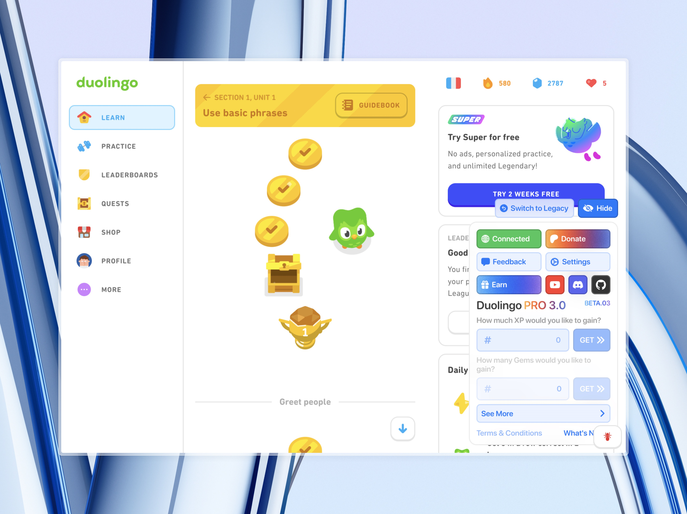
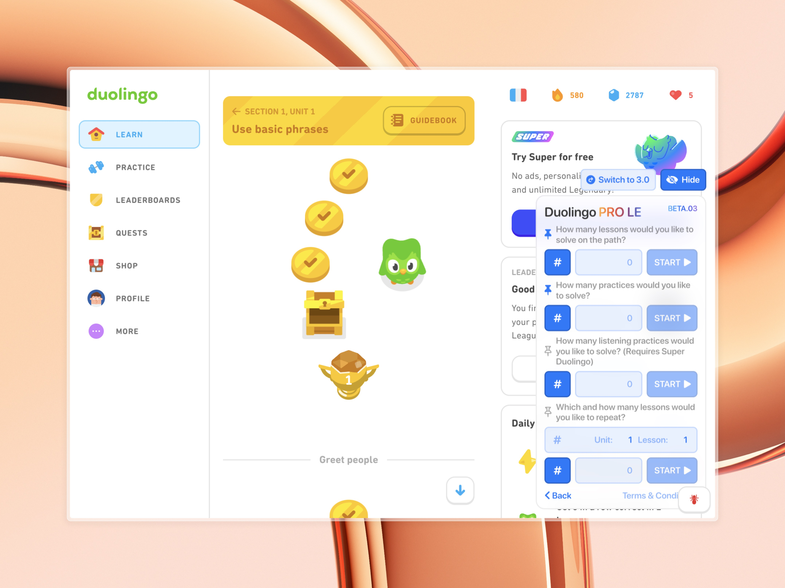
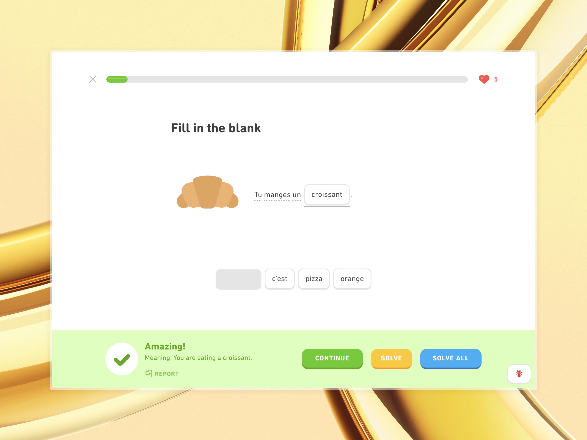
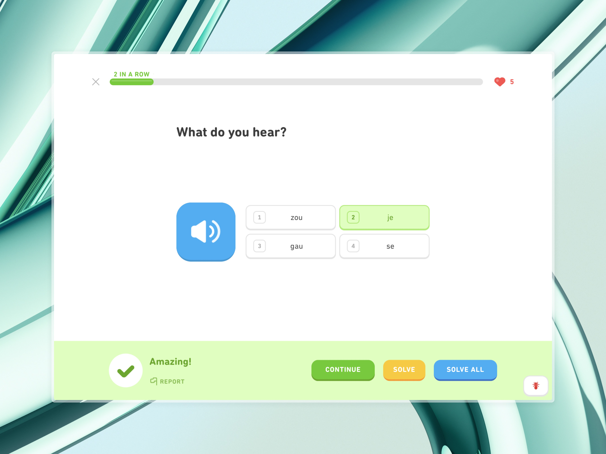
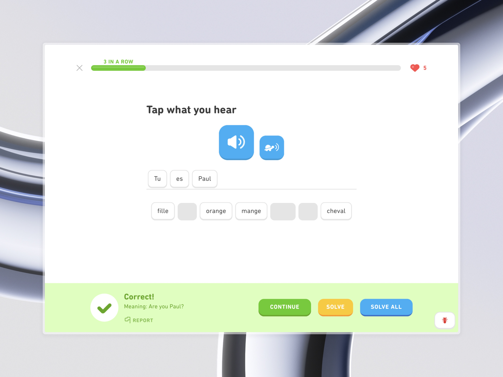
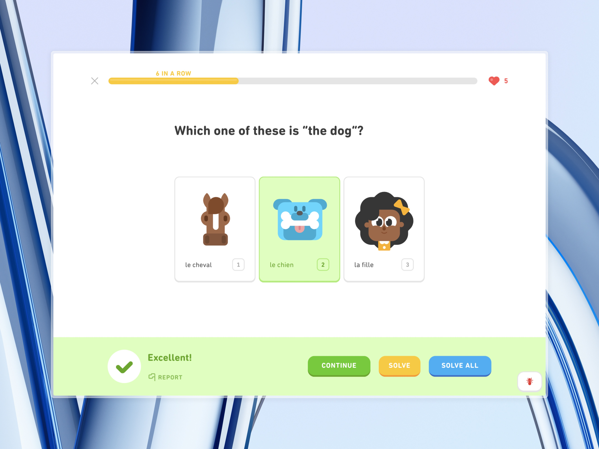
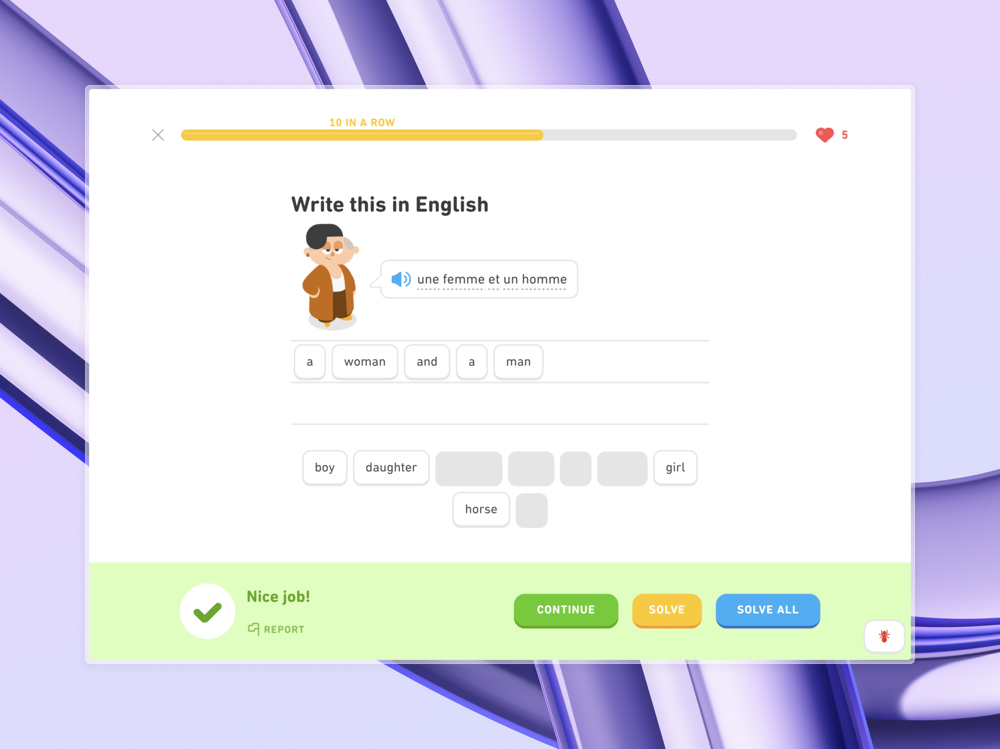
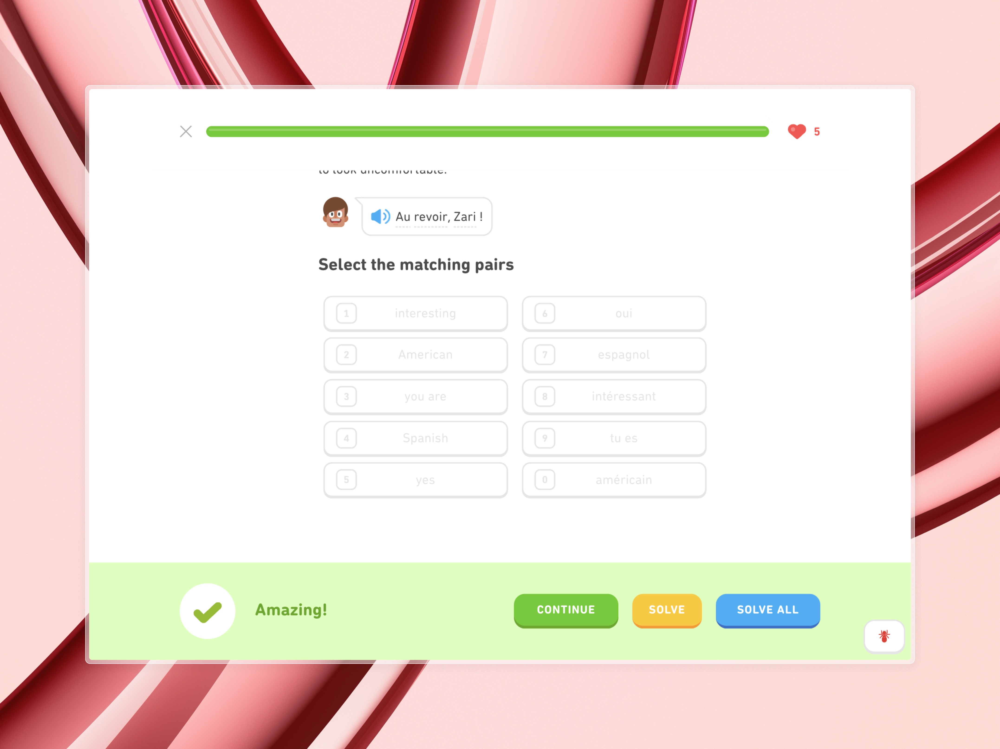

## Table of Contents
- [About Duolingo PRO](#about-duolingo-pro)
- [Features](#features)
- [If You Run Into An Issue, Try...](#if-you-run-into-an-issue-try)
- [Images](#images)
- [Repository Activity](#repository-activity)

## About Duolingo PRO
Duolingo PRO 3.0 is an auto-solver user-script for gaining XP instantly, farming XP automatically, completing quests, leveling up on the leaderboard, extending your streak, and more, for Duolingo. 
Working as of March 2025. 
Join our [Discord server](https://discord.gg/r8xQ7K59Mt) to get the latest news, talk with the developers, report bugs, and do much more.
Subscribe to our [Youtube channel](https://www.youtube.com/@DuolingoPROscript) for the latest updates.

## Features
- Instantly get the amount of XP you want.
- Automatically solve questions.
- Solve a set or an infinite number of lessons and practices, all automatically.
- Increase your streak by an amount you want.
- Get free XP boosts.
- Get free streak freezes.
- Refill your hearts for free.
- Dark mode.
- Hide/Show Duolingo PRO.
- Send feedback.
- More coming soon! (AutoServer, Gems, other features)

## If You Run Into An Issue, Try...
1) Ensure you are using the latest version of Duolingo PRO.
2) Ensure you are using Tampermonkey, other userscript managers are not verified to work.
3) If you are using Chrome, ensure you have Developer Mode ON under Chrome Settings > Extensions.
4) Try using Chrome or at the very least a Chromium browser.
5) Join our [Discord server](https://discord.gg/r8xQ7K59Mt) for further support.
Additionally, you can find tutorials in our [Youtube channel](https://www.youtube.com/@DuolingoPROscript).

## Images

## Repository Activity

