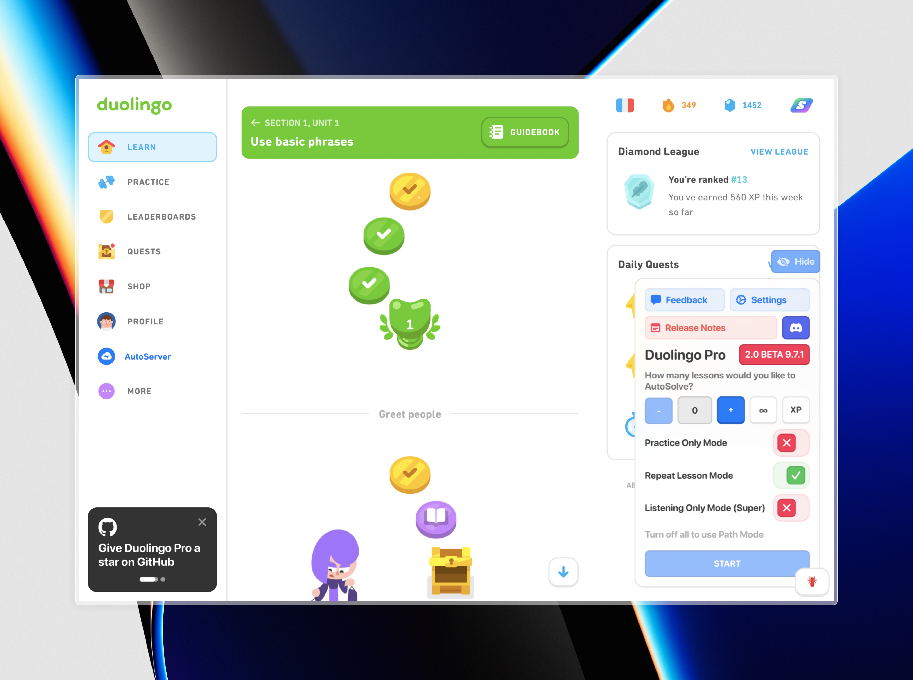
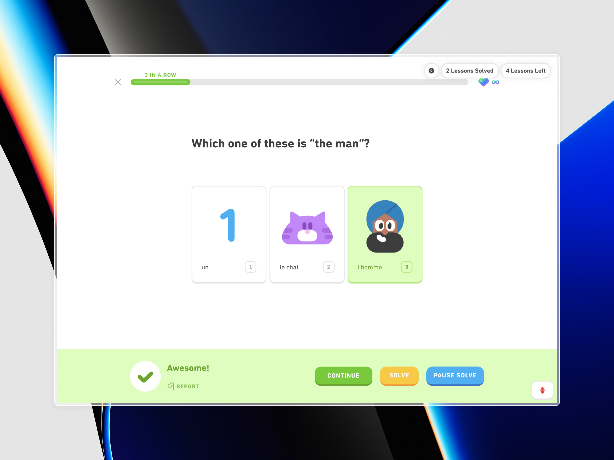
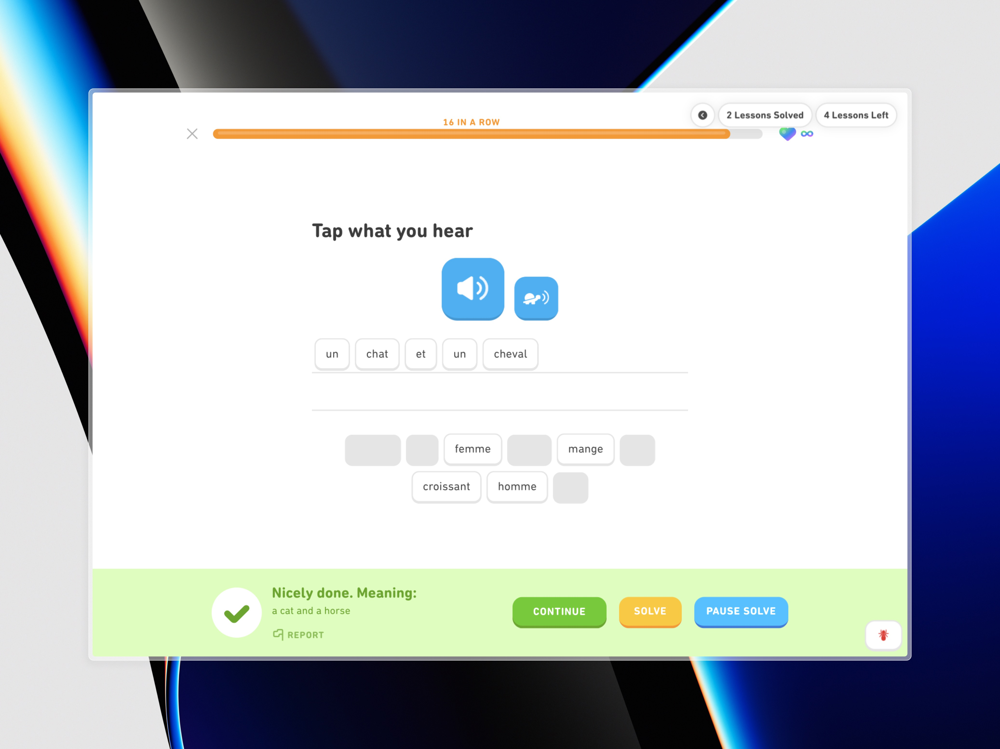

## Table of Contents
- [About Duolingo PRO](#about-duolingo-pro)
- [Features](#features)
- [If You Run Into An Issue, Try...](#if-you-run-into-an-issue,-try...)
- [Images](#images)
- [Repository Activity](#repository-activity)

## About Duolingo PRO
Duolingo PRO 3.0 is an auto-solver user-script for gaining XP instantly, farming XP automatically, completing quests, leveling up on the leaderboard, extending your streak, and more, for Duolingo. 
Working as of November 2024. 
Join our [Discord server](https://discord.gg/r8xQ7K59Mt) to get the latest news, talk with the developers, report bugs, and do much more.

## Features
- Instantly get the amount of XP you want.
- Automatically solve questions.
- Solve a set or infinite number of lessons and practices, all automatically.
- Hide/Show Duolingo PRO.
- Send feedback.
- More coming soon! (AutoServer, Gems, Streak Edit, other features)

## If You Run Into An Issue, Try...
1) Ensure you are using the latest version of Duolingo PRO.
2) Ensure you are using Tampermonkey, other userscript managers are not verified to work.
3) If you are using Chrome, ensure you have Developer Mode ON under Chrome Settings > Extensions.
4) Try using Chrome or at the very least a Chromium browser.
5) Join our [Discord server](https://discord.gg/r8xQ7K59Mt) for further support.

## Images

## Repository Activity

